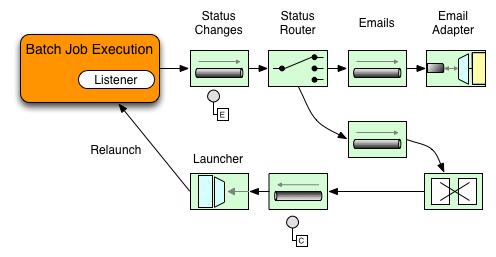

Spring Batch Integration
========================

Many users of [Spring Batch][] may encounter requirements that are outside the scope of [Spring Batch][], yet may be efficiently and concisely implemented using [Spring Integration][]. Conversely, [Spring Batch][] users may encounter [Spring Batch][] requirements and need a way to efficiently integrate both frameworks. In this context several patterns and use-cases emerge and *Spring Batch Integration* will address those requirements:

* [Launching Batch Jobs through Messages](#launching-batch-jobs-through-messages)
* [Providing Feedback with Informational Messages](#providing-feedback-with-informational-messages)
* [Externalizing Batch Process Execution](#externalizing-batch-process-execution)

# Downloading artifacts

## Using Maven

	<dependency>
	    <groupId>org.springframework.batch</groupId>
	    <artifactId>spring-batch-integration</artifactId>
	    <version>1.2.2.BUILD-SNAPSHOT</version>
	</dependency>

## Using Gradle

	compile 'org.springframework.batch:spring-batch-integration:1.2.2.BUILD-SNAPSHOT'

# Documentation

## Namespace Support

As of Spring Batch Integration 1.3, we start providing dedicated XML Namespace support, with the aim to provide an easier configuration experience. In order to activate the namespace, add the following namespace declarations to your Spring XML Application Context file:

```xml
<beans ...
	xmlns:batch-int="http://www.springframework.org/schema/batch-integration"
	xsi:schemaLocation="...
		http://www.springframework.org/schema/batch-integration http://www.springframework.org/schema/batch-integration/spring-batch-integration.xsd">
	...
</beans>
```
A fully configured Spring XML Application Context file for Spring Batch Integration may look like the following:

```xml
<beans xmlns="http://www.springframework.org/schema/beans"
	xmlns:xsi="http://www.w3.org/2001/XMLSchema-instance"
	xmlns:int="http://www.springframework.org/schema/integration"
	xmlns:batch="http://www.springframework.org/schema/batch"
	xmlns:batch-int="http://www.springframework.org/schema/batch-integration"
	xmlns:jdbc="http://www.springframework.org/schema/jdbc"
	xsi:schemaLocation="
		http://www.springframework.org/schema/batch-integration http://www.springframework.org/schema/batch-integration/spring-batch-integration.xsd
		http://www.springframework.org/schema/batch http://www.springframework.org/schema/batch/spring-batch.xsd
		http://www.springframework.org/schema/beans http://www.springframework.org/schema/beans/spring-beans.xsd
		http://www.springframework.org/schema/integration http://www.springframework.org/schema/integration/spring-integration.xsd
		http://www.springframework.org/schema/jdbc http://www.springframework.org/schema/jdbc/spring-jdbc.xsd">
	...
</beans>
```

You can also append version numbers to the referenced XSD file such as:

```xml
xsi:schemaLocation="...
	http://www.springframework.org/schema/batch-integration http://www.springframework.org/schema/batch-integration/spring-batch-integration.xsd">
```

However, as a version-less declaration will always use the latest schema, we generally don't recommend appending the version number to the XSD name. Adding a version number, for instance, would create possibly issues when updating the *Spring Batch Integration* dependencies as they may require more recent versions of the XML schema.

## Launching Batch Jobs through Messages

When starting jobs using the Spring Batch API you have to invoke *[JobLauncher](http://static.springsource.org/spring-batch/apidocs/org/springframework/batch/core/launch/JobLauncher.html).run()* with the respective parameters. However, it is up to you how to execute this method. This may for example involve starting the job via a *main()* method using a shell script. It would be much more powerful, though, to execute the batch job using [Spring Integration][] and its numerous adapters. For example you can use an *File Inbound Channel Adapter* to monitor a directory in the file-system, and start the Batch Job as soon as the input file arrives. Maybe you need to poll a remote (S)FTP server to retrieve the data for the Batch Job. Implementing these scenarios with [Spring Integration][] is easy as it allow for an event-driven execution of the *JobLauncher*.

Keep in mind that you are not restricted to support only one input source either. In fact, multiple different adapters may easily provide the data for your Batch Jobs from multiple sources simultaneously using configuration only.

*Spring Batch Integration* provides the *[JobLaunchingMessageHandler](http://static.springsource.org/spring-batch-admin/apidocs/org/springframework/batch/integration/launch/JobLaunchingMessageHandler.html)* that you can use to launch batch jobs. The input for the *JobLaunchingMessageHandler* is provided by a [Spring Integration][] message, which payload is of type *[JobLaunchRequest](http://static.springsource.org/spring-batch-admin/apidocs/org/springframework/batch/integration/launch/JobLaunchRequest.html)*. This class is a wrapper around the Job that needs to be launched as well as the [JobParameters](http://static.springsource.org/spring-batch/apidocs/org/springframework/batch/core/JobParameters.html) necessary to launch the Batch job. 

The following image illustrates the typical [Spring Integration][] message flow in order to start a Batch job.


### Transforming a file into a JobLaunchRequest

```java
public class FileMessageToJobRequest {
    private Job job;
    private String fileParameterName;

    public void setFileParameterName(String fileParameterName) {
        this.fileParameterName = fileParameterName;
    }
    public void setJob(Job job) {
        this.job = job;
    }
    
    @Transformer
    public JobLaunchRequest toRequest(Message<File> message) {
        JobParametersBuilder jobParametersBuilder = new JobParametersBuilder();
        jobParametersBuilder.addString(fileParameterName, message.getPayload().getAbsolutePath());
        return new JobLaunchRequest(job, jobParametersBuilder.toJobParameters());
    }
}
```

### The JobExecution Response

When a Batch is being executed a [JobExecution](http://static.springsource.org/spring-batch/apidocs/org/springframework/batch/core/JobExecution.html	) instance is returned. This instance can be used to determine the status of an execution. If a *JobExecution* was able to be created successfully, it will always be returned, regardless of whether or not the actual execution was successful.

For more information, please see the Spring Batch reference documentation at: 

* http://static.springsource.org/spring-batch/reference/html/domain.html#domainJobExecution

### Java Bean Configuration

```xml
<batch:job-repository data-source="dataSource" id="jobRepository"
	transaction-manager="transactionManager" table-prefix="BATCH_"/>

<bean id="batchjobExecutor" class="org.springframework.batch.core.launch.support.SimpleJobLauncher">
	<property name="jobRepository" ref="jobRepository"/>
</bean>

<int:transformer input-channel="files" output-channel="requests">
	<bean class="com.manning.siia.batch.FileMessageToJobRequest">
		<property name="job" ref="importPayments"/>
		<property name="fileParameterName" value="input.file.name"/>
	</bean>
</int:transformer>

<int:service-activator method="launch" input-channel="requests"
	output-channel="statuses">
	<bean class="org.springframework.batch.integration.launch.JobLaunchingMessageHandler">
		<constructor-arg ref="jobLauncher"/>
	</bean>
</int:service-activator>
```

### XML Namespace Support

As of *Spring Batch Integration 1.3*, dedicated XML namespace for launching *[Spring Batch][]* jobs is available. This allows you to rewrite the above *Service Activator* with:

```xml
<batch-int:job-launching-gateway  request-channel="requestChannel" reply-channel="replyChannel" job-launcher="jobLauncher"/>
```

#### Available Attributes of the Job-Launching Gateway

**id**
Identifies the underlying Spring bean definition, which is an instance of either:

* [EventDrivenConsumer](http://static.springsource.org/spring-integration/api/org/springframework/integration/endpoint/EventDrivenConsumer.html) or
* [PollingConsumer](http://static.springsource.org/spring-integration/api/org/springframework/integration/endpoint/PollingConsumer.html)

The exact implementation depends on whether the component's input channel is a

* [SubscribableChannel](http://static.springsource.org/spring-integration/api/org/springframework/integration/core/SubscribableChannel.html) or
* [PollableChannel](http://static.springsource.org/spring-integration/api/org/springframework/integration/core/PollableChannel.html)

**auto-startup**
Boolean flag to indicate that the endpoint should start automatically on startup. The default is *true*.

**request-channel**
The input [MessageChannel](http://static.springsource.org/spring-integration/api/org/springframework/integration/MessageChannel.html) of this endpoint.

**reply-channel**
*Message Channel* to which the resulting *[JobExecution](http://static.springsource.org/spring-batch/apidocs/org/springframework/batch/core/JobExecution.html)* payload will be sent.

**reply-timeout**
Allows you to specify how long this gateway will wait for the reply message to be sent successfully to the reply channel before throwing an exception. This attribute only applies when the channel might block, for example when using a bounded queue channel that is currently full.

Also, keep in mind that when sending to a [DirectChannel](http://static.springsource.org/spring-integration/api/org/springframework/integration/channel/DirectChannel.html), the invocation will occur in the sender's thread. Therefore, the failing of the send operation may be caused by other components further downstream.

The *reply-timeout* attribute maps to the *sendTimeout* property of the underlying [MessagingTemplate](http://static.springsource.org/spring-integration/api/org/springframework/integration/core/MessagingTemplate.html) instance (org.springframework.integration.core.MessagingTemplate). The attribute will default, if not specified, to *-1*, meaning that by default, the Gateway will wait indefinitely. The value is specified in milliseconds.

**job-launcher**
Pass in a custom *[JobLauncher](http://static.springsource.org/spring-batch/apidocs/org/springframework/batch/core/launch/JobLauncher.html)* bean reference. This attribute is optional. If not specified the adapter will re-use the default instance (under the id *jobLauncher*, e.g. when using the [@EnableBatchProcessing](http://static.springsource.org/spring-batch/apidocs/org/springframework/batch/core/configuration/annotation/EnableBatchProcessing.html) annotation via JavaConfig). If no default instance exists an exception is thrown.

**order**
Specifies the order for invocation when this endpoint is connected as a subscriber to a [SubscribableChannel](http://static.springsource.org/spring-integration/api/org/springframework/integration/core/SubscribableChannel.html).

#### Sub-Elements

When this Gateway is receiving messages from a [PollableChannel](http://static.springsource.org/spring-integration/api/org/springframework/integration/core/PollableChannel.html), you must either provide a global default Poller or provide a Poller sub-element to the 
*Job-Launching Gateway*:

```xml
<batch-int:job-launching-gateway  request-channel="queueChannel" reply-channel="replyChannel" job-launcher="jobLauncher">
	<int:poller fixed-rate="1000"/>
</batch-int:job-launching-gateway>
```

## Providing Feedback with Informational Messages

As [Spring Batch][] jobs can run for long times, providing progress information will be critical. For example, stake-holders may want to be notified if a Batch Job has failed. [Spring Batch][] provides support for this information being gathered through:

* Active polling or
* Event-driven, using listeners.

When starting a *Spring Batch* job, e.g. by using the *Job-Launching Gateway*, a [JobExecution](http://static.springsource.org/spring-batch/apidocs/org/springframework/batch/core/JobExecution.html	) instance is returned which can be continuously monitored (polling) in order to retrieve status updates. However, this is considered sub-optimal and an event-driven approach should be preferred. 

Therefore, [Spring Batch][] provides listeners such as:

* [StepListener](http://static.springsource.org/spring-batch/apidocs/org/springframework/batch/core/StepListener.html)
* [ChunkListener](http://static.springsource.org/spring-batch/apidocs/org/springframework/batch/core/ChunkListener.html)
* [JobExecutionListener](http://static.springsource.org/spring-batch/apidocs/org/springframework/batch/core/JobExecutionListener.html)

In the following example, a *Spring Batch* job was configured with *JobExecutionListener*. Thus, *Spring Integration* will receive and process any Batch job status changes. For example, the received *JobExecution* can be inspected using a *Router*. Job that are deemed recoverable may cause a restart of a Spring Batch job while a successful job completion may be routed to an Mail Outbound Channel Adapter, so that Email notification are sent out. 



Here is a brief example how a listener is configured: 

```xml
<batch:job id="importPayments">
    ...
    <batch:listeners>
        <batch:listener ref="notificationExecutionsListener"/>
    </batch:listeners>
</batch:job>

<int:gateway id="notificationExecutionsListener"
    service-interface="o.s.batch.core.JobExecutionListener"
    default-request-channel="jobExecutions"/>
```

## Externalizing Batch Process Execution

The 2 integration approaches discussed so far suggest use-cases where Spring Integration wraps Spring Batch like an outer-shell. However, [Spring Batch][] can also use [Spring Integration][] internally. Using this approach, [Spring Batch][] users can delegate the processing of items or even chunks to outside processes. This allows you to offload complex processing. For example, a *ItemProcessor* can server as a messaging gateway deferring the processing of items to the message bus.

For complex, long running processing, performance can be increased by using asynchronous item processing. *Spring Batch Integration* provides wrapper components for your *ItemWriter* and *ItemProcessor*:

*[AsyncItemWriter](http://static.springsource.org/spring-batch/spring-batch-integration/apidocs/org/springframework/batch/integration/async/AsyncItemWriter.html)* *[AsyncItemProcessor](http://static.springsource.org/spring-batch/spring-batch-integration/apidocs/org/springframework/batch/integration/async/AsyncItemProcessor.html)*

This allows you to implement basically *fork-join* scenarios. The *Gateway* invocations are executed concurrently instead sequentially. The *AsyncItemWriter* will gather the results and write back the chunk as soon as all the results become available.

Taking things one step further, one can also externalize the chunk processing using the *[ChunkMessageChannelItemWriter](http://static.springsource.org/spring-batch/spring-batch-integration/apidocs/org/springframework/batch/integration/chunk/ChunkMessageChannelItemWriter.html)* which is provided by *Spring Batch Integration*. That way you can send an entire chunk to a Gateway reducing *Spring Batch*'s responsibilities to read items, group them and send out the chunk. Once sent, *Spring Batch* will continue the process of reading and grouping items, without waiting for the results. Rather it is the responsibility of the *ChunkMessageChannelItemWriter* to gather the results and integrate them back into the Spring Batch process. 

Using *Spring Integration* you have full control over the concurrency of your processes e.g. by using *QueueChannel*s instead of *DirectChannels*. Furthermore, by relying on *Spring Integration*'s rich collection of Channel Adapters (E.g. JMS or AMQP), you can distribute chunks of a Batch job to external systems for processing.

For more information, please also consult the *Spring Batch* manual, specifically the chapter on [Remote Chunking](http://static.springsource.org/spring-batch/reference/html/scalability.html#remoteChunking).

# Resources

## Further Reading

### Books

The book [Spring Integration in Action][] by Mark Fisher, Jonas Partner, Marius Bogoevici and Iwein Fuld provides a dedicated on how to use [Spring Integration][] and [Spring Batch][] together.

[Pro Spring Integration][] by Dr. Mark Lui, Mario Gray, Andy Chan and Josh Long has a chapter titled *Spring Integration and Spring Batch*. 

[Pro Spring Batch][] by Michael Minella, provides detailed information on *Spring Batch Integration* in Chapter 11, *Scaling and Tuning*.

### Presentations

* Introduction to Spring Integration and Spring Batch (video)
  - http://www.infoq.com/presentations/Spring-Integration-Batch
* Introduction to Spring Integration and Spring Batch (slides)
  - http://www.slideshare.net/hillert/introduction-to-spring-integration-and-spring-batch
* Deploying and Monitoring Spring Integration and Spring Batch Applications
  - http://www.slideshare.net/DaveSyer/syer-monitoring-integration-and-batch

### Articles

* Spring Batch integration module for GridGain
  - http://aloiscochard.blogspot.com/2010/04/spring-batch-integration-module-for.html

## Related GitHub projects

### Spring Batch

* [Spring Batch][]
* [Spring Batch Admin][]

### Spring Integration

* [Spring Integration][]
* [Spring Integration Samples][]
* [Spring Integration Templates][]
* [Spring Integration Dsl Groovy][]
* [Spring Integration Dsl Scala][]
* [Spring Integration Pattern Catalog][]

### Spring XD

* [Spring XD][]

### Spring for Apache Hadoop

* [Spring for Apache Hadoop][]

## Getting support

Check out the [Spring forums][] and the [spring-integration][spring-integration tag] and [spring-batch][spring-batch tag] tags on [Stack Overflow][]. [Commercial support][] is available too.

## Issue Tracking

Report issues via the [Spring Batch Admin JIRA][].

## Building from source

*Spring Batch Integration* is built using [Maven][].

### Check out sources

	git clone git://github.com/SpringSource/spring-batch-admin.git

### Go to the Spring Batch Integration project

	$ cd spring-batch-admin/spring-batch-integration

### Compile and test, build all jars

	$ mvn clean package

### Install project into your local Maven cache

	$ mvn install

## Contributing

[Pull requests][] are welcome. Please see the [contributor guidelines][] for details. Additionally, if you are contributing, we recommend following the process for Spring Integration as outlined in the [administrator guidelines][].

## Contributors

* [@david_syer](https://twitter.com/david\_syer) - Dave Syer
* [@michaelminella](https://twitter.com/michaelminella) - Michael Minella
* [@ghillert](https://twitter.com/ghillert) - Gunnar Hillert

## License

The Spring Integration Extensions Framework is released under version 2.0 of the [Apache License][] unless noted differently for individual extension Modules, but this should be the rare exception.

[administrator guidelines]: https://github.com/SpringSource/spring-integration/wiki/Administrator-Guidelines
[Apache License]: http://www.apache.org/licenses/LICENSE-2.0
[Pull requests]: http://help.github.com/send-pull-requests
[Spring Batch]: http://www.springsource.org/spring-batch/
[Spring Integration]: http://www.springsource.org/spring-integration/
[contributor guidelines]: https://github.com/SpringSource/spring-integration/wiki/Contributor-guidelines

[Maven]: http://maven.apache.org
[Spring Batch Admin JIRA]: https://jira.springsource.org/browse/BATCHADM

[Spring Batch]: https://github.com/SpringSource/spring-batch
[Spring Batch Admin]: https://github.com/SpringSource/spring-batch-admin

[Spring Integration Samples]: https://github.com/SpringSource/spring-integration-samples
[Spring Integration Templates]: https://github.com/SpringSource/spring-integration-templates/tree/master/si-sts-templates
[Spring Integration Dsl Groovy]: https://github.com/SpringSource/spring-integration-dsl-groovy
[Spring Integration Dsl Scala]: https://github.com/SpringSource/spring-integration-dsl-scala
[Spring Integration Pattern Catalog]: https://github.com/SpringSource/spring-integration-pattern-catalog

[Spring XD]: https://github.com/SpringSource/spring-xd
[Spring for Apache Hadoop]: https://github.com/SpringSource/spring-hadoop

[Spring Integration in Action]: http://www.manning.com/fisher/
[Pro Spring Integration]: http://www.apress.com/9781430233459
[Pro Spring Batch]: http://www.apress.com/9781430234524

[Spring forums]: http://forum.springsource.org
[spring-integration tag]: http://stackoverflow.com/questions/tagged/spring-integration
[spring-batch tag]: http://stackoverflow.com/questions/tagged/spring-batch

[Stack Overflow]: http://stackoverflow.com/faq
[Commercial support]: http://springsource.com/support/springsupport
